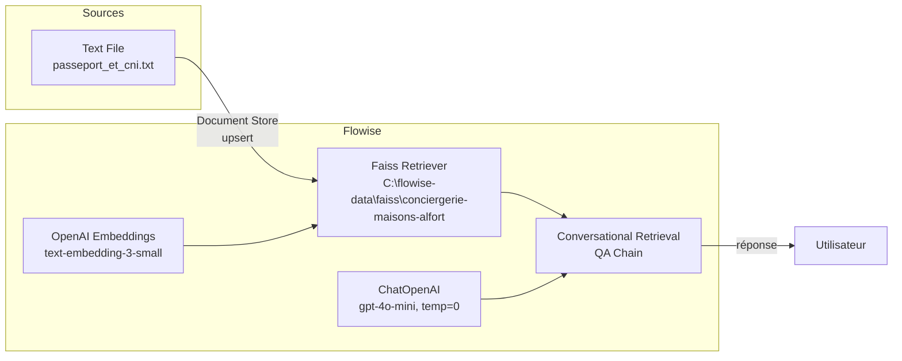

# Conciergerie IA “Maisons-Alfort” — Résumé, architecture, onboarding

**Partageable tel quel à l’équipe.** Ce qui est en place, où, et comment ne pas casser.

> **Règle équipe : plus de reset.** La config Conciergerie Maisons-Alfort (Flowise, FAISS, chatflow) est **validée et stable**. Pas de réinitialisation du projet, des credentials ou du chemin FAISS sans accord explicite. On ne reset pas.

> **Intégration locale** : le chatbot est intégré dans la landing LPPP en **local** (pas de prod Squid Research pour l’instant). URL landing : **`/p/maisons-alfort/`**. L’iframe utilise `flowise_embed_url` (construit par `get_flowise_chat_embed_url()`). En local : `FLOWISE_URL` vide ou `http://localhost:3000`, `FLOWISE_CHATFLOW_ID` dans `.env` ; Flowise doit tourner (ex. `docker compose up -d flowise` ou instance sur le port 3000).

---

## Objectif

Mettre en place une IA de conciergerie administrative capable de répondre **uniquement** à partir de documents officiels (ex : démarches passeport / CNI de la mairie de Maisons-Alfort), via un **moteur RAG basé sur FAISS**.

---

## Architecture mise en place (validée et fonctionnelle)

### 1. Source documentaire

| Élément | Détail |
|--------|--------|
| **Type** | Text File Loader |
| **Fichier exemple** | `passeport_et_cni.txt` (voir `docs/flowise-workflows/sources/passeport_et_cni.txt`) |
| **Contenu** | Procédures administratives mairie (passeport, CNI, pièces, délais…) |

➡️ Ces fichiers sont ingérés, découpés, vectorisés et stockés localement.

### 2. Vectorisation & stockage (FAISS)

| Élément | Détail |
|--------|--------|
| **Moteur vectoriel** | FAISS (local) |
| **Embeddings** | Provider : **OpenAI**, modèle : **text-embedding-3-small** |
| **Chemin FAISS (CRITIQUE)** | `C:\flowise-data\faiss\conciergerie-maisons-alfort` |

⚠️ Ce chemin est utilisé à la fois :
- lors de l’**upsert** (Document Store) ;
- dans le node **Faiss Retriever** du canvas.

👉 **Toute différence de chemin = FAISS introuvable = erreur runtime.**

### 3. Canvas Flow (ordre exact)

```
[ OpenAI Embeddings ]
          │
          ▼
     [ Faiss Retriever ]
          │
          ▼
[ Conversational Retrieval QA Chain ]
          ▲
          │
     [ ChatOpenAI ]
```

### 4. Modèle de réponse

| Paramètre | Valeur |
|-----------|--------|
| **LLM** | gpt-4o-mini (latest) |
| **Température** | 0 (réponses factuelles) |
| **Mode** | RAG strict (réponse basée sur le contexte uniquement) |

➡️ Si l’info n’est pas dans les documents, le modèle ne l’invente pas.

---

## Schéma d’architecture (1 page)



---

## État actuel

- ✅ Upsert FAISS effectué  
- ✅ Index présent sur disque  
- ✅ Requêtes test fonctionnelles  
- ✅ Réponses cohérentes et sourcées (ex : renouvellement passeport)

**Exemple de question test :** « comment renouveler mon passeport ? »  
**Réponse :** conforme aux documents mairie + ANTS.

---

## Points de vigilance pour l’équipe

| Règle | Détail |
|-------|--------|
| **Chemin FAISS** | Ne jamais modifier sans refaire un upsert. |
| **Câblage** | Ne pas brancher ChatOpenAI directement au Faiss. Toujours passer par la **Conversational Retrieval QA Chain**. |
| **Erreur "faiss.index not found"** | L’index n’existe pas ou le chemin est faux. Vérifier `C:\flowise-data\faiss\conciergerie-maisons-alfort`. |
| **Nouveau document** | Nécessite un **nouvel upsert** (ré-ingestion + vectorisation). |

---

## Nommage & repères

| Élément | Valeur |
|---------|--------|
| **Projet Flowise** | conciergerie-maisons-alfort |
| **Document Store** | mairies-maisons-alfort-docs |
| **FAISS folder** | `C:\flowise-data\faiss\conciergerie-maisons-alfort` |
| **Embeddings model** | text-embedding-3-small |
| **LLM réponse** | gpt-4o-mini |

---

## Checklist “onboard développeur”

- [ ] Flowise installé et démarré (local ou Docker).
- [ ] Credential **OpenAI API** configurée dans Flowise.
- [ ] Dossier FAISS créé : `C:\flowise-data\faiss\conciergerie-maisons-alfort` (ou chemin identique au canvas).
- [ ] Importer le chatflow : **Chatflows** → **Import** → choisir `chatflow-conciergerie-maisons-alfort-restore.json` (dans `docs/flowise-workflows/`).
- [ ] Vérifier dans le node **Faiss** que **Base Path** = `C:\flowise-data\faiss\conciergerie-maisons-alfort`.
- [ ] Si l’index n’existe pas : utiliser **Document Store** (Text File Loader) avec le même chemin FAISS + **OpenAI Embeddings** → lancer l’upsert.
- [ ] Tester avec : « comment renouveler mon passeport ? » → la réponse doit citer mairie, ANTS, pièces, rendez-vous.
- [ ] Ne pas connecter **ChatOpenAI** directement au **Faiss** ; garder **Conversational Retrieval QA Chain** au milieu.

---

## Fichiers de référence dans le dépôt

| Fichier | Rôle |
|---------|------|
| `docs/flowise-workflows/chatflow-conciergerie-maisons-alfort-restore.json` | Canvas à ré-importer dans Flowise (FAISS path Windows). |
| `docs/flowise-workflows/sources/passeport_et_cni.txt` | Exemple de document source pour l’upsert. |
| `docs/flowise-workflows/conciergerie-maisons-alfort-etat-valide-prompts.md` | Prompts finaux (rephrase, response) validés. |
| `docs/flowise-workflows/backups/` | Sauvegardes ExportData Flowise si besoin de restauration. |

---

## Prochaines évolutions possibles

- Ajout d’autres démarches (actes de naissance, mariage, élections…).
- Ajout d’un splitter si les fichiers grossissent.
- Ajout d’une mémoire conversationnelle.
- Ajout d’un message légal « réponse basée sur les infos municipales ».
